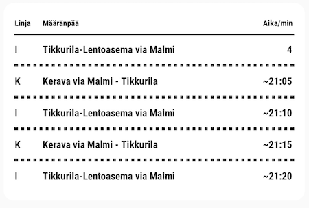

This is a custom component for Home Assistant, which adds a single stop (bus
or tram stop, train or metro platform) from Helsinki Region Transport
(Helsingin seudun liikenne, HSL, Helsingforsregionens trafik, HRT),
Waltti or another Digitransit-supported region as a Home Assistant sensor.

Search for a stop using the name or stop code. Search results will include extra
details, like the stop code or platform number, which should allow you to tell
them apart if there are several results.

You'll also need a Digitransit API key. You can sign up for one for free
on [the Digitransit website](https://digitransit.fi/en/developers/api-registration/).

## Pre-release warning

The basic functionality works, but this isn't yet ready for wider use, so
use this at your own risk.

Another limitation is that stations are not currently supported, only
stops. This means you can't monitor all departures from a station
with multiple stops or platforms.

Before a stable release, these will be addressed, and it's possible that
addressing these will break the current functionality, so if you want to
use this already, please check the release notes carefully before upgrading.

## Installation

Installing with HACS is recommended.

First, install the custom integration using [HACS](https://hacs.xyz/):

1. Add the integration using HACS
1. Restart Home Assistant

[](https://my.home-assistant.io/redirect/hacs_repository/?owner=Mallonbacka&repository=custom-component-digitransit)

Then add a new integraion:

1. Go to **Settings**, then **Devices & Services**
1. Click **Add Integration**
1. Select 'Digitransit' from the list
1. Enter your API key and follow the instructions to find your local stop.

## Usage

The sensor counts down to the next uncancelled departure.

The attributes are as follows:

- `departures` - a list of upcoming departures from the given stop, each with the following details, mostly direct from the Digitransit API:
  - `scheduledDeparture` - timezone-aware datetime string of the departure time according to the timetable.
  - `realtimeDeparture` - timezone-aware datetime string of the departure time according to live information.
  - `departureDelay` - the number of seconds late this service is running. Negative numbers indicate it is running ahead of schedule.
  - `realtimeState` - one of `ADDED` (not present in the timetable), `CANCELED`, `MODIFIED` (the pattern has changed), `SCHEDULED` (no real-time information used), `UPDATED` (the pattern stays the same, while the times may be adjusted slightly).
  - `headsign` - the headsign when the vehicle is at this stop.
  - `route` - the short name of the route the vehicle is following, for example a bus number.
  - `shortHeadsign`- if the length of `headsign` is over 15 characters, then the first word from `headsign` (e.g. "Mattby (M) via Kilo" becomes "Mattby"), otherwise the whole value of `headsign`.
- `compact_departures` - a string, up to 28 characters long, combining the route and departure time of the next few departures. For example, `19:42 P, :47 A, :52 P` means train P departs at 19:42, followed by train A at 19:47, then P at 19:52. This is designed to display on small screens.

### Cards

You can show the data on a dashboard using a card. To use the following examples, create a card using the "code editor" view to add a YAML definition, and swap `sensor.pasila_h0089_next_departure` to your own sensor ID.

#### HSL-style departures card

This custom card, in the style of HSL's departures signs, is available from the [Leissson/HSL-Departure-Card repository](https://github.com/Leissson/HSL-Departure-Card). It can be installed with HACS.



Follow the instructions in the repository to install and configure it.

#### Entity Card

Adding the sensor to an "Entity Card" shows the name, icon and number of minutes to the next departure (on any line):


```yaml
type: entity
entity: sensor.pasila_h0089_next_departure
state_color: false
```

#### Markdown card

If you want to show the lines, and see several upcoming departures, this can be acheived with a markdown card:


```yaml
type: markdown
content: >-
  | Arrival | in | Line | Destination |

  | :------ | :---- | :--: | :------ |

  

  

    {{-
  as_datetime(arrival_time).strftime("%H:%M") }} |  {%- set min_left =
  ((as_timestamp(as_datetime(arrival_time).strftime("%Y-%m-%d %H:%M:%S")) -
  as_timestamp(now()))/60) | round(0) %}  {{min_left}}min {{(min_left / 60) | int}}h
  {{(min_left % 60) }}m  | {{- departure.route }} |  {{- departure.headsign}}
  |

   
```

Thanks to [@samhaa](https://github.com/samhaa) for contributing the markdown example.

### Devices

- To display departures on an NSPanel, see [this comment by Vitaly Repin](https://github.com/Mallonbacka/custom-component-digitransit/pull/129#issuecomment-2835639022).

## Credits

This repository is based on the excellent [integration_blueprint](https://github.com/ludeeus/integration_blueprint)
template.
